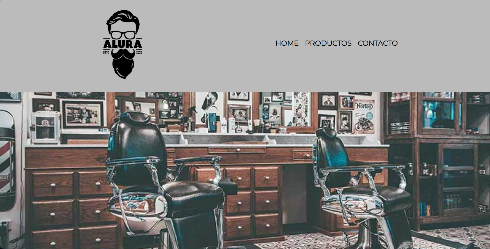

# 👥 Barbería Alura Website


A responsive website for a barbershop featuring services, contact form, and location information.

## 📑 Table of Contents

- [👥 Barbería Alura Website](#-barbería-alura-website)
  - [📑 Table of Contents](#-table-of-contents)
  - [✨ Features](#-features)
  - [🌐 Live Demo](#-live-demo)
  - [📸 Screenshots](#-screenshots)
  - [🚀 Installation](#-installation)
  - [📁 Project Structure](#-project-structure)
  - [🛠️ Technologies Used](#️-technologies-used)
  - [🤝 Contributing](#-contributing)
  - [📄 License](#-license)

## ✨ Features

- Responsive design for mobile and desktop
- Services showcase with pricing
- Interactive contact form
- Business hours table
- Google Maps integration
- Image gallery
- YouTube video integration

## 🌐 Live Demo

Visit the live website: [barberia-alura.devprojects.tech](https://barberia-alura.devprojects.tech)

## 📸 Screenshots

| Desktop | Mobile |
|---------|---------|
|  |  |

## 🚀 Installation

1. Clone the repository

```bash
git clone https://github.com/sandovaldavid/Barberia_Alura.git
```

1. Open `index.html` in your browser

## 📁 Project Structure

``` notes
barberia-alura/
├── index.html          # Home page
├── productos.html      # Products/services page
├── contacto.html       # Contact form page
├── style.css          # Main styles
├── reset.css          # CSS reset
├── styles-home.css    # Home-specific styles
└── imagenes/          # Images directory
```

## 🛠️ Technologies Used

- HTML5
- CSS3
- Google Fonts
- Google Maps API
- YouTube Embed

## 🤝 Contributing

1. Fork the project
2. Create your feature branch (`git checkout -b feature/AmazingFeature`)
3. Commit your changes (`git commit -m 'Add some AmazingFeature'`)
4. Push to the branch (`git push origin feature/AmazingFeature`)
5. Open a Pull Request

## 📄 License

This project is licensed under the MIT License - see the LICENSE file for details.

---
<p align="center">
Made by <a href="https://github.com/sandovaldavid">@sandovaldavid</a>
</p>
